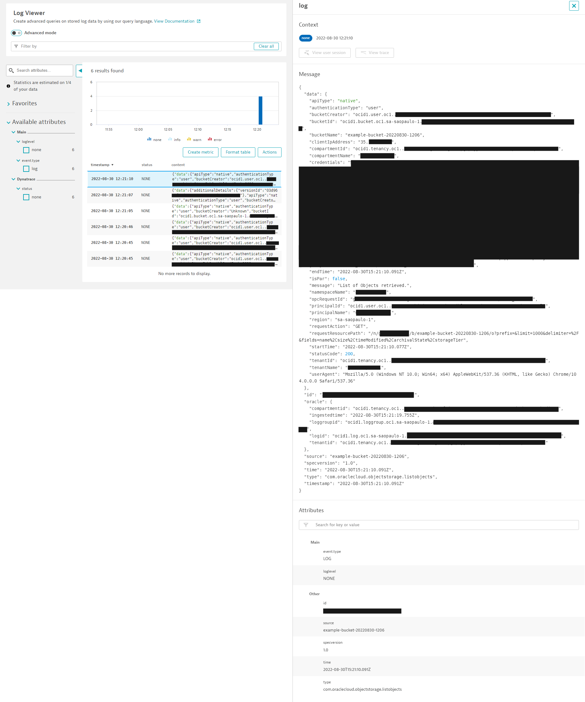

> **Warning**
>
> This project is under development.

# Pre-requisites

* If you don't have an account in the Oracle Cloud, please follow [How to set up an Oracle Cloud account](ORACLE-CLOUD.md)
* Local development environment
    - Docker 17.10.0-ce or later installed and running
* Using a [supported service](https://docs.oracle.com/en-us/iaas/Content/Logging/Concepts/service_logs.htm)

# Set up local configuration

1. Create an `~/.oci` directory
1. Create a file `~/.oci/config`
1. Access User icon > My Profile > Resources > API keys
1. Click on "Add API key"
1. Click on "Download private key"
1. Save the key file in `~/.oci`
1. Click on "Add"
1. Copy the contents presented
1. Paste the contents in the `config` file
1. Adjust the name of the profile (for example `functions-developer-profile`)
1. Adjust the `key_file` value
1. Change permissions in the key file

    `chmod go-rwx ~/.oci/<private-key-file-name>.pem`

1. [Install the Fn Project CLI](https://docs.oracle.com/en-us/iaas/Content/Functions/Tasks/functionsquickstartlocalhost.htm#ariaid-title12) (Section C. Set up your local host dev environment, Step 3)

# Create a function

1. Create a context for this compartment and select it for use

    `fn create context <context-name> --provider oracle`

    `fn use context <context-name>`

1. Update the context with the compartment ID and the Oracle Functions API URL.

    `fn update context oracle.compartment-id <ocid>`

    `fn update context oracle.image-compartment-id <ocid>`

    `fn update context api-url https://functions.<location>.oraclecloud.com`

    See [API URLs](https://docs.oracle.com/en-us/iaas/api/#/en/functions/20181201/) to get the right URL.

1. Define a unique repository name prefix to distinguish your function images from other people’s. 

    `fn update context registry gru.ocir.io/<tenancy namespace>/[repo-name-prefix]`

1.  Log into the Registry using the Auth Token as your password

    `docker login -u '<tenancy namespace>/<username>' gru.ocir.io`

1. Access the directory of the log forwarding function inside this repo

    `cd dynatrace-log-forwarding`

1. Deploy your function to the application created previously in [Account Preparation](ACCOUNT-PREPARATION.md)

    `fn deploy --app dynatrace-integration`

# Create the log group

1. Open the menu > Observability & Management > Log Groups
1. Create a Log Group with name "dynatrace-logs"

# Configure service to write logs

If you are using the Object Storage service as the example from "Account Preparation", then follow below:

1. Access the bucket created
1. Click on Logs
1. Enable "Read Access Events" and "Write Access Events" specifying "dynatrace-logs" as the Log Group

# Create a Service Connector

1. Open the menu > Observability & Management > Service Connectors
1. Create Service Connector called "dynatrace-log-connector"
1. Source: Logging
1. Target: Functions
1. In the "Configure source" section, select the "dynatrace-logs" Log Group and "read" logs
1. Click "+ another log"
1. Select the "dynatrace-logs" Log Group and "write" logs.
1. In the "Configure target" section, select the "dynatrace-integration" Application
1. In the "Configure target" section, select the "log-forwarder" Function.

# Testing

1. Access the bucket created
1. Upload a file to the bucket

The actions executed in the "Objects" page are sufficient to generate logs. For example, just opening the page will trigger a `com.oraclecloud.objectstorage.listobjects` log event.

# Example

