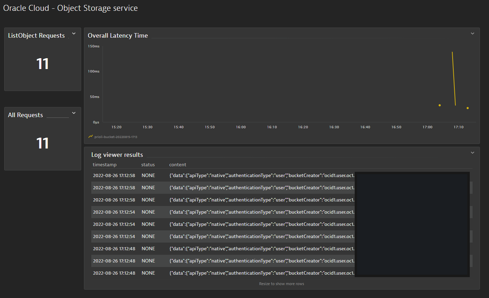

> **Warning**
>
> This project is under development.

# Dynatrace Oracle OCI integration

With the serverless functions in this repository you are able to bring metrics and logs from Oracle Cloud Infrastructure (OCI) to Dynatrace.

1. [Set up an Oracle Cloud account](ORACLE-CLOUD.md)
1. [Prepare the Oracle Cloud account](ACCOUNT-PREPARATION.md)
1. [Set up log forwarding](LOGS.md)
1. [Set up metric forwarding](METRICS.md)

# Next steps

* Make set up easier without requiring manual configuration in the Oracle Cloud Account and without needing to set up a dev environment
